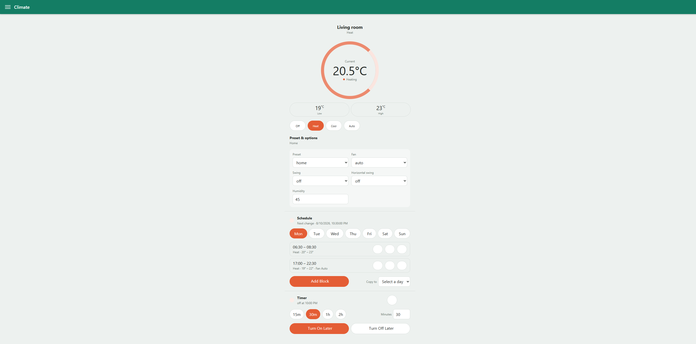
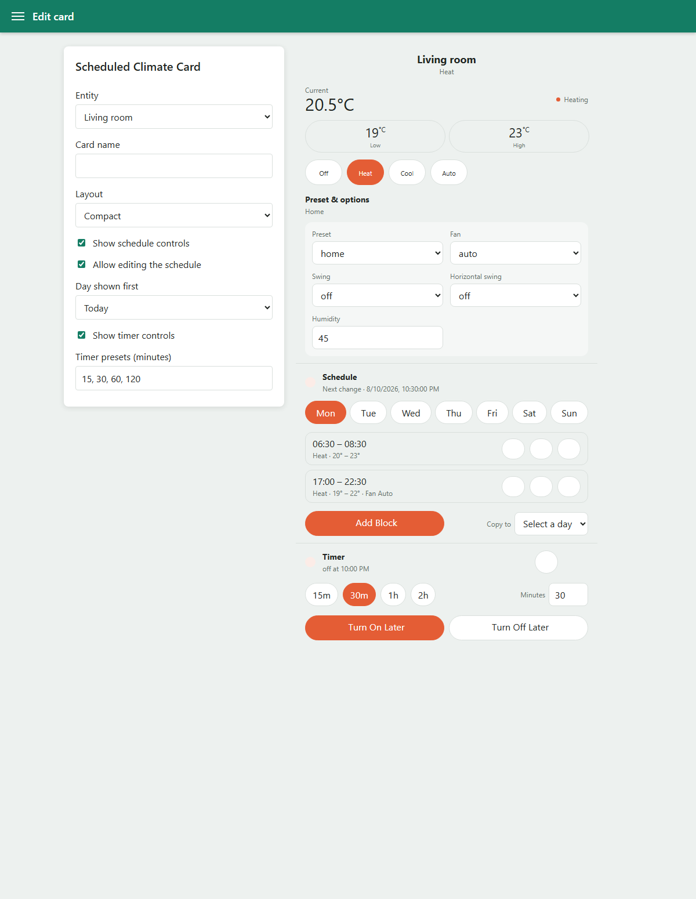
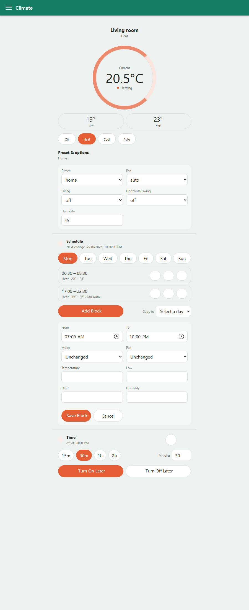
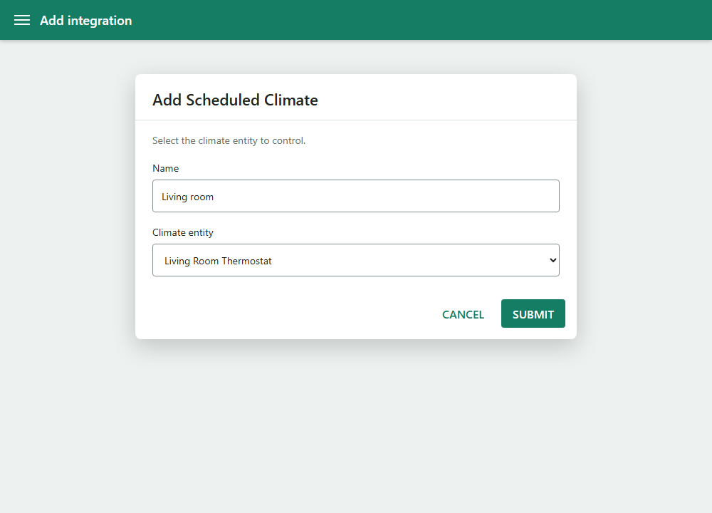
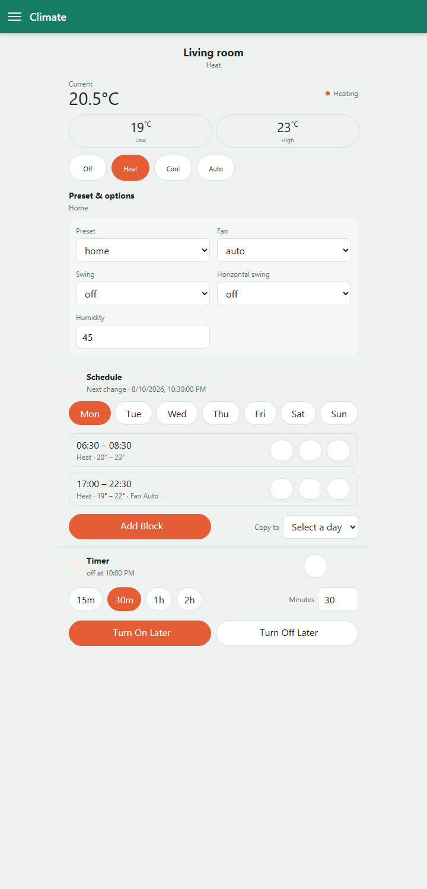

# Scheduled Climate

Scheduled Climate is a Home Assistant custom integration that wraps an existing climate entity with a weekly schedule built on the Home Assistant schedule helper, persistent one-shot timers, and a matching dashboard card.

Requires Home Assistant 2026.1 or newer. Local integration branding is available on Home Assistant 2026.3 or newer.

## Showcase

| Full climate and schedule controls | Compact card and visual editor |
| --- | --- |
|  |  |

Edit weekly blocks from the dashboard, including HVAC mode, temperature or range setpoints, fan mode, and humidity:

<p align="center">
  
</p>

See the **[complete user guide](docs/USER_GUIDE.md)** for installation, configuration screenshots, card options, schedule behavior, timer automations, permissions, migration, diagnostics, and troubleshooting.

## Installation

1. Add this repository to HACS as a custom integration.
2. Install **Scheduled Climate** and restart Home Assistant.
3. Open **Settings > Devices & services > Add integration**, select **Scheduled Climate**, and choose the climate entity to wrap.

The integration serves and registers its dashboard card automatically. A separate frontend download or Lovelace resource is not required.



## Dashboard Card

Add the card through the dashboard visual editor or use YAML:

```yaml
type: custom:scheduled-climate-card
entity: climate.living_room_scheduled
name: Living room
layout: compact
timer_presets:
  - 15
  - 30
  - 60
  - 120
show_schedule: true
schedule_editable: true
default_schedule_day: monday
show_timer: true
```

The card derives all schedule and timer state from the wrapper entity. It displays only climate controls supported by that entity, including HVAC mode, target temperature, preset, fan, swing, and humidity controls where available.

The `layout` option accepts `standard` (the default) or `compact`. Compact layout removes the circular temperature dial while retaining touch-friendly temperature and HVAC controls. Preset and climate options, the schedule, and the timer can each be collapsed; their states are retained per entity in the current browser.

Set `schedule_editable: false` to render the schedule read-only. Editing is always read-only for non-administrators, because the schedule helper websocket API requires administrator rights. `default_schedule_day` selects the day shown first; the current day is used when it is omitted.



## Weekly Schedule

Each wrapper is linked to a Home Assistant **schedule** helper. Every time block in that helper can carry climate settings as block data:

| Key | Meaning |
| --- | --- |
| `hvac_mode` | HVAC mode to select while the block is active |
| `temperature` | Single target temperature |
| `target_temp_low` / `target_temp_high` | Target temperature range (set both) |
| `fan_mode` | Fan mode |
| `humidity` | Target humidity |

Link a helper from the integration options, or create and link one directly from the card. The HVAC mode is always applied before setpoints. When a block omits the mode, the most recently active supported mode is restored, falling back to the configured default. Outside every block the wrapper turns the target off, or leaves it untouched when **Off behavior** is set to `ignore`.

Blocks that request a setting the target entity cannot accept are applied as far as possible; the unsupported parts are skipped, logged, and surfaced as a repair issue.

Upgrading from a release that used a single daily on and off time keeps those times visible on the wrapper entity and raises a repair issue. Use the card's **Create schedule** button to convert them into a weekly schedule, or link an existing helper from the options.

## Timers

Only one timer is active per wrapper. Starting a new on or off timer replaces the current timer. Timer deadlines are stored in UTC and survive restart. An overdue timer executes once when Home Assistant starts and is then cleared.

Services:

- `scheduled_climate.start_on_timer`
- `scheduled_climate.start_off_timer`
- `scheduled_climate.cancel_timer`
- `scheduled_climate.link_schedule`

Timer start services require a positive `duration`. `link_schedule` takes the storage `schedule_id` of a schedule helper and enables the schedule; call it without an id to unlink the current helper.

## Troubleshooting

- If the card is not listed after installation, restart Home Assistant and force-refresh the browser. The integration registers a content-versioned module URL automatically.
- If the wrapper is unavailable, verify that its selected target climate entity still exists and is available.
- If an on action does nothing, confirm that the target exposes at least one HVAC mode other than `off`.
- Reconfigure the integration from **Settings > Devices & services** if the controlled climate entity changes.
- Enable debug logging for `custom_components.scheduled_climate` when reporting a service or callback failure.

## Development

Backend validation runs on Linux because Home Assistant requires POSIX modules unavailable in native Windows test runs:

```powershell
docker run --rm -v "${PWD}:/workspace" -w /workspace python:3.13-bookworm sh -c "set -e; pip install 'homeassistant>=2026.1.0' 'pytest-homeassistant-custom-component>=0.13.200' 'pytest-cov>=6.0' --quiet; python -m pytest -q"
```

Build the card from `frontend`:

```powershell
npm install
npm run check
npm test
npm run build
```

The production bundle is written to `custom_components/scheduled_climate/frontend/scheduled-climate-card.js`.

## License

Scheduled Climate is available under the [MIT License](LICENSE).
