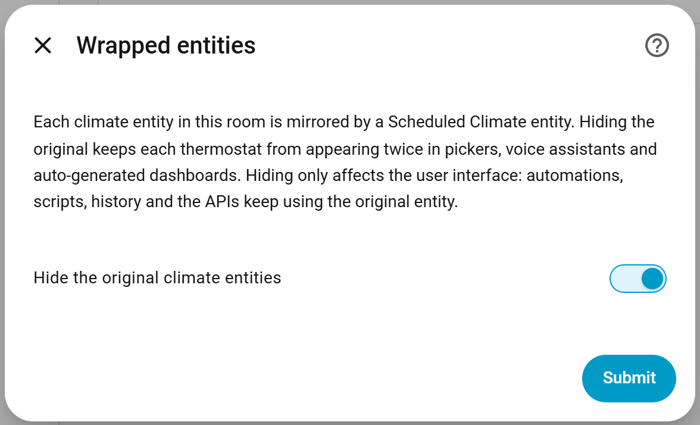
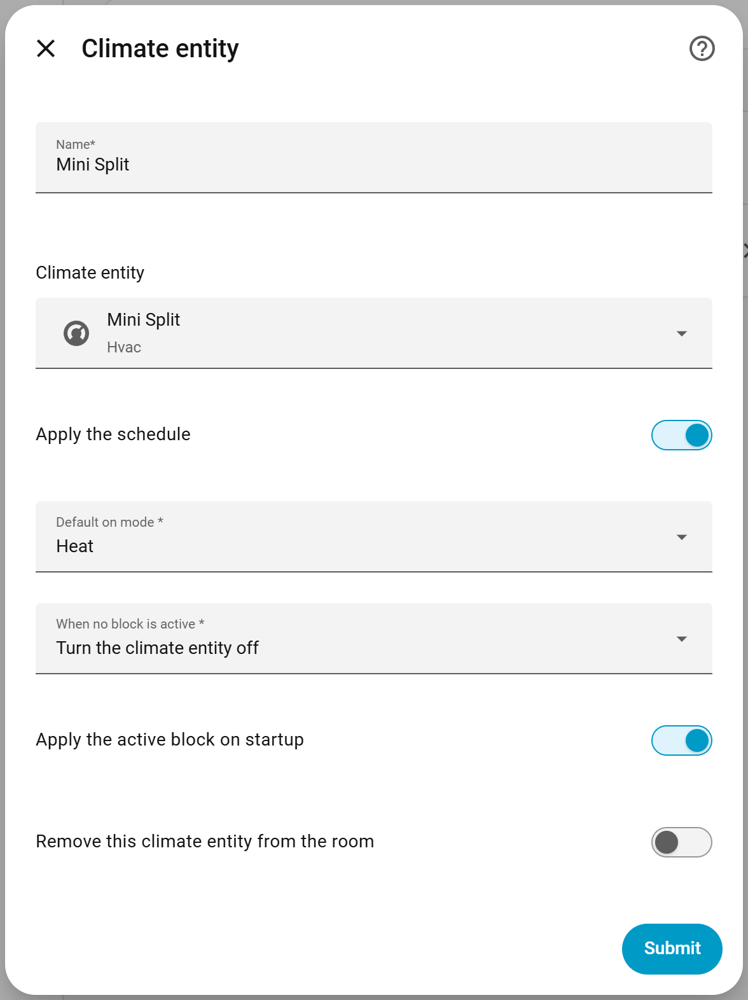
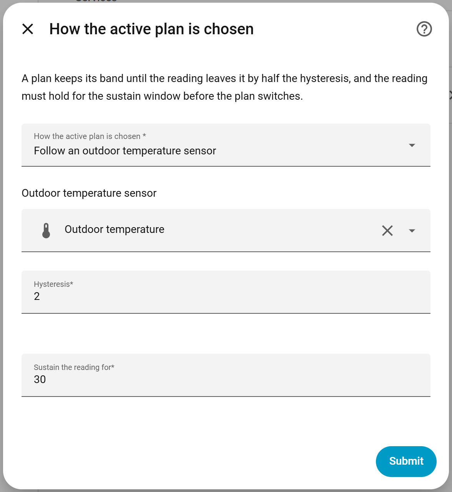
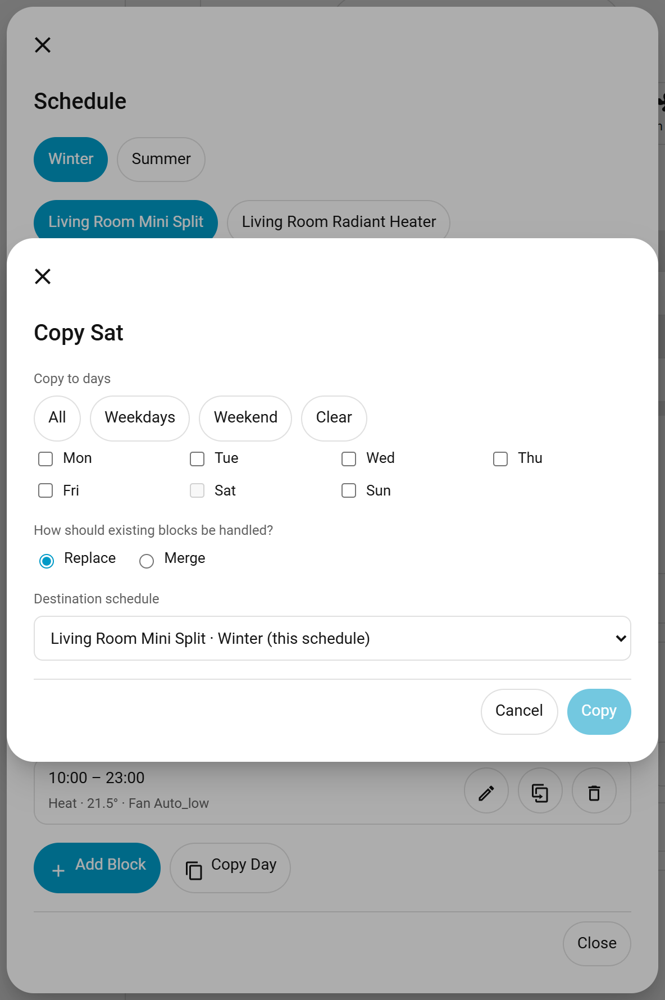
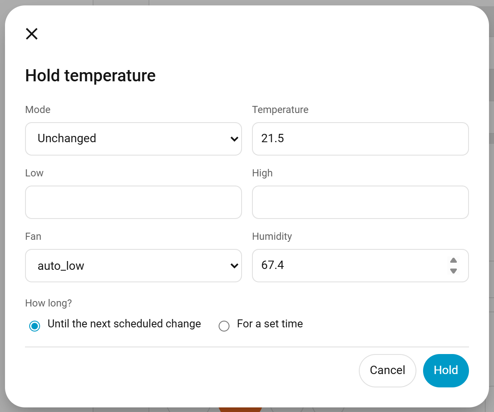

# Scheduled Climate User Guide

Scheduled Climate wraps existing Home Assistant climate entities with weekly schedules, persistent one-shot timers, temporary holds, and a dashboard card. The original climate entities continue to communicate with their devices; use the new Scheduled Climate entities for dashboard controls and automations that should participate in scheduling.

One config entry describes a **room**. A room can hold more than one climate entity — a mini split and a radiant heater, for example — and more than one named **plan**, such as a `Winter` plan that heats and a `Summer` plan that cools. Every target in the room follows the active plan, and the active plan can be chosen by hand, by an automation, or automatically from an outdoor temperature sensor.

## Requirements

- Home Assistant 2026.1 or newer
- HACS, or a manual custom integration installation
- At least one existing `climate` entity to control
- An administrator account to create or edit schedules

Home Assistant restricts schedule helper *edits* to administrators, and that restriction cannot be lifted by an integration. Reading a schedule is not restricted, so everyone else gets a read-only view of the week plus full use of holds, pause/resume, and timers — see [Holds](#place-a-temporary-hold).

Local integration branding requires Home Assistant 2026.3 or newer. The integration registers its dashboard card automatically, so a separate Lovelace resource is not needed.

## Install

### HACS

1. Open **HACS > Integrations**.
2. Open the three-dot menu and choose **Custom repositories**.
3. Enter this repository URL, select **Integration**, and add it.
4. Find **Scheduled Climate** in HACS and select **Download**.
5. Restart Home Assistant.

### Manual installation

1. Copy `custom_components/scheduled_climate` into the `custom_components` directory in the Home Assistant configuration directory.
2. Restart Home Assistant.

After upgrading either installation, restart Home Assistant and force-refresh open dashboards if the card still shows an older version.

## Add the integration

1. Open **Settings > Devices & services**.
2. Select **Add integration**.
3. Search for and select **Scheduled Climate**.
4. Enter a room name and select the first climate entity to wrap.
5. Select **Submit**.


The integration creates a device for the room, one wrapper climate entity per target — normally with a `_scheduled` suffix such as `climate.living_room_scheduled` — a `select` entity for the active plan, and a plan named `Default`. It rejects missing targets, another Scheduled Climate wrapper, and a target already used by another Scheduled Climate room.

The original climate entity is hidden once it is wrapped, so each thermostat appears once rather than twice. See [Why your thermostats disappear from pickers](#why-your-thermostats-disappear-from-pickers).

To rename the room later, open **Settings > Devices & services > Scheduled Climate**, select the entry's three-dot menu, and choose **Reconfigure**. Climate entities are added, edited and removed from **Configure**. A wrapper follows its target when the target's entity ID is renamed in Home Assistant.

### Upgrading from a single-entity entry

Existing entries migrate automatically. The entry becomes a room holding its one climate entity and a single plan named `Default`, with any linked schedule helper carried into that plan. The wrapper entity keeps its unique ID, so its history, dashboards and automations are untouched.

## Configure the room

Open **Settings > Devices & services > Scheduled Climate** and select **Configure** on the entry. The options are a menu:


| Menu entry | Purpose |
| --- | --- |
| **Add a climate entity** | Adds another target to the room. |
| **Edit a climate entity** | Renames a target, re-points it at a different climate entity, changes how it reacts to its schedule, or removes it from the room. |
| **Add a plan** | Creates a named plan, optionally with an icon and the outdoor temperature at or above which it takes over. |
| **Edit a plan** | Renames a plan, changes its icon or temperature threshold, or deletes it. |
| **Link a schedule helper** | Points one target *and* one plan at a schedule helper. |
| **Plan selection** | Chooses whether the active plan is picked by hand or from an outdoor temperature sensor. |
| **Holds** | Sets the default and maximum length of a temporary hold. |
| **Wrapped entities** | Chooses whether the original climate entities stay visible. |

Removing a target or deleting a plan never deletes the schedule helpers you own; only the link to them is dropped.

### Why your thermostats disappear from pickers

Each climate entity you add is mirrored by a Scheduled Climate entity — for example `climate.living_room` gains `climate.living_room_scheduled`. Leaving both visible would show every thermostat twice, so the original is **hidden** while Scheduled Climate wraps it. This is the same approach Home Assistant uses for its own `switch_as_x` helper.



Hiding affects the user interface only. Automations, scripts, history and the REST and websocket APIs keep addressing the original entity exactly as before, and the wrapper forwards every command to it.

The original becomes visible again automatically when you remove the target from the room or uninstall the integration. To keep both visible, turn off **Wrapped entities** in the options. An entity you hid yourself is left alone.

### Per-target schedule behaviour

**Edit a climate entity** exposes these settings for the selected target.



| Setting | Behavior |
| --- | --- |
| **Apply the schedule** | Enables automatic application of active blocks for this target. A helper must be linked for the active plan before this has any effect. |
| **Default on mode** | HVAC mode used when a block does not specify a mode and no recent supported active mode can be restored. |
| **When no block is active** | Either turns this target off or leaves its current state unchanged. |
| **Apply the active block on startup** | Immediately applies the current block after Home Assistant starts. Disable this when startup should preserve the device's current state until the next schedule transition. |

Because these settings are per target, one device in a room can be paused while another keeps running.

### Schedule helpers, one per target and plan

A Home Assistant schedule helper stores a flat set of values per time block, so it cannot describe two devices at once. Scheduled Climate therefore uses **one helper for each target and plan pair**. A room with two devices and two plans uses four helpers. The card creates and links them for you — open the schedule editor, pick the plan and target, and select **Create schedule** — or link existing helpers from **Link a schedule helper** in the options.

## Plans and seasonal switching

Each room exposes `select.<room>_schedule_plan`. Its options are every plan name, plus **Automatic** when an automatic rule is configured. Whatever the select holds is what the whole room follows, so automations, scripts and voice assistants can switch plans:

```yaml
action: select.select_option
target:
  entity_id: select.living_room_schedule_plan
data:
  option: Summer
```

`scheduled_climate.select_plan` does the same thing from any wrapper entity, and accepts `automatic`:

```yaml
action: scheduled_climate.select_plan
target:
  entity_id: climate.living_room_scheduled
data:
  plan: automatic
```

### Automatic selection from an outdoor temperature sensor

Set **Plan selection** to *Follow an outdoor temperature sensor* and choose the sensor. Then give each plan the outdoor temperature at or above which it should take over. Plans form ascending bands, and the plan with no threshold is the base band used when it is colder than every other plan.



| Setting | Behavior |
| --- | --- |
| **Outdoor temperature sensor** | The entity whose numeric state drives the choice. |
| **Hysteresis** | The width of the dead band around each threshold. The active plan keeps its band until the reading leaves it by half this width, which stops the selection flapping at a boundary. |
| **Sustain the reading for** | How long a new band must hold continuously before the plan actually switches. Set to `0` to switch immediately. |

For example, with a `Winter` plan that has no threshold, a `Summer` plan set to `18`, and a hysteresis of `2`: the room moves to `Summer` at `19` and back to `Winter` below `17`.

Selecting a plan by hand overrides the sensor and stays put until **Automatic** is selected again. If the sensor becomes unavailable or stops reporting a number, the last resolved plan stays in force and a repair issue is raised.

## Add the dashboard card

1. Open a dashboard and select **Edit dashboard**.
2. Select **Add card**.
3. Search for **Scheduled Climate Card**.
4. Select any Scheduled Climate entity from the room and adjust the card options.
5. Select **Save**.


One card covers the whole room: it reads the sibling entities from the entity you choose and offers a target switcher when the room holds more than one.

The visual editor provides these options:

| Option | Purpose |
| --- | --- |
| **Entity** | Any Scheduled Climate wrapper in the room. |
| **Card name** | Optional title override. |
| **Layout** | `standard` includes the circular current-temperature dial; `compact` removes it. |
| **Show the active plan** | Shows or hides the active plan chip and its picker. |
| **Show schedule controls** | Shows or hides the schedule summary and the **Edit schedule** button. |
| **Allow editing the schedule** | Allows administrator editing. Non-administrators always receive a read-only view. |
| **Show hold controls** | Shows or hides the **Hold** button. |
| **Day shown first** | Opens the editor on a selected weekday, or the current day when set to **Today**. |
| **Plan shown first** | Opens the editor on a named plan, or the active plan by default. |
| **Show timer controls** | Shows or hides one-shot timer controls. |
| **Timer presets** | Positive, comma-separated minute values shown as quick choices. |

### YAML configuration

```yaml
type: custom:scheduled-climate-card
entity: climate.living_room_scheduled
name: Living room
layout: compact
show_plan: true
show_schedule: true
schedule_editable: true
show_override: true
default_schedule_day: monday
default_plan: Winter
show_timer: true
timer_presets:
  - 15
  - 30
  - 60
  - 120
```

The card itself stays compact: room name, the active plan, the next scheduled change, a target switcher, the controls for the selected target, a **Hold** button, and the timer row. The full weekly editor opens in a dialog from **Edit schedule**, which keeps the card readable as a room gains devices and plans.

The complete standard layout exposes every feature supported by the wrapped target, including temperature ranges, HVAC modes, presets, fan, swing, horizontal swing, and humidity.


The compact layout retains the same controls while using less vertical space.


The optional sections can be collapsed independently. Collapse state is stored per entity in the current browser.

## Build a weekly schedule

Select **Edit schedule** on the card to open the editor. It edits the linked Home Assistant schedule helper directly.

The dialog is organised as plan tabs, then target tabs, then a week timeline showing all seven days at once. Select a block on the timeline to edit it, or select empty space on a day to start a new block there.

1. Choose the plan and the target you want to edit.
2. Select a block, or select **Add block**.
3. Choose **From** and **To** times.
4. Add the climate settings to apply during the block.
5. Select **Save block**.


Blocks on the same day cannot overlap. The card sorts blocks by start time and validates them before updating the helper.

### Copy a day to several days

Select **Copy** to open the copy dialog:

1. Tick every day the blocks should go to, or use the **All**, **Weekdays** and **Weekend** quick picks.
2. Choose **Replace** to overwrite each target day, or **Merge** to keep what is already there and add only the blocks that fit.
3. Optionally choose a different plan or target as the destination.
4. Select **Copy**.



Merging reports any day where a block was dropped because it overlapped something already on that day. Each affected schedule helper is written once, no matter how many days were copied.

Each block can contain the following data:

| Key | Meaning |
| --- | --- |
| `hvac_mode` | HVAC mode applied first. |
| `temperature` | Single target temperature. |
| `target_temp_low` and `target_temp_high` | Target range; provide both values. |
| `fan_mode` | Fan mode. |
| `humidity` | Target humidity. |

The editor only shows settings supported by the target entity. If a helper is edited elsewhere and includes an unsupported value, Scheduled Climate applies the supported parts, logs the skipped parts, and creates a repair issue.

When a block begins, its HVAC mode is applied before its setpoint. If the block omits `hvac_mode`, the integration restores the most recently active supported mode and otherwise uses **Default on mode**. When no block is active, **When no block is active** determines whether the target turns off or remains unchanged.

Schedule editing requires a Home Assistant administrator, and an integration cannot work around that: the schedule helper's `create`, `update` and `delete` WebSocket commands are restricted to administrators by Home Assistant itself. Reading is not restricted, so other users see the whole week but cannot add, duplicate, edit, delete, or copy blocks. They can still use holds, pause and resume the schedule, and run timers.

## Place a temporary hold

A hold parks one target at settings of your choosing and suspends the schedule until it lapses. Holds are available to **every** user, which is how household members without an administrator account change the heating.

1. Select **Hold** on the card.
2. Choose the settings to apply.
3. Choose **Until the next scheduled change**, or a length of time.
4. Select **Hold**.



While a hold is running, the card shows when it ends and offers **Resume schedule**. When it lapses the integration immediately re-applies whatever the schedule asks for at that moment. Holds are persisted, so they survive a Home Assistant restart, and a hold that expired while Home Assistant was stopped is simply dropped.

The maximum and default hold length are set under **Holds** in the integration options. A requested length longer than the maximum is shortened.

Starting a timer clears any running hold, because the timer is the newer instruction.

A hold cannot be placed while the wrapped climate entity is unavailable. Home Assistant skips unavailable entities when a service targets them, so the call quietly does nothing; wait for the device to come back and try again.

### Automation examples

Hold the living room at 21 °C until the next scheduled change:

```yaml
action: scheduled_climate.set_override
target:
  entity_id: climate.living_room_scheduled
data:
  until_next_block: true
  temperature: 21
```

Hold at 18 °C for two hours, then hand control back:

```yaml
action: scheduled_climate.set_override
target:
  entity_id: climate.living_room_scheduled
data:
  duration:
    hours: 2
  hvac_mode: heat
  temperature: 18
```

Resume the schedule immediately:

```yaml
action: scheduled_climate.clear_override
target:
  entity_id: climate.living_room_scheduled
```

## Use one-shot timers

The timer section can turn the wrapper on or off after a delay:

1. Select a preset or enter a positive number of minutes.
2. Select **Turn on later** or **Turn off later**.
3. Use the cancel button beside an active timer to clear it.

Only one timer can be active for each target. Starting another timer replaces the current timer, and clears any running hold. Deadlines are stored in UTC and survive restarts. If a deadline passes while Home Assistant is stopped, the action runs once after startup and the timer is cleared.

### Automation examples

Turn the living room off after 45 minutes:

```yaml
action: scheduled_climate.start_off_timer
target:
  entity_id: climate.living_room_scheduled
data:
  duration:
    minutes: 45
```

Cancel its active timer:

```yaml
action: scheduled_climate.cancel_timer
target:
  entity_id: climate.living_room_scheduled
```

Link a schedule helper from an automation or Developer Tools. `schedule_id` is the helper's storage ID, normally the object ID without the `schedule.` domain. The helper is linked to the target you aim at, for the currently active plan unless you name another one:

```yaml
action: scheduled_climate.link_schedule
target:
  entity_id: climate.living_room_scheduled
data:
  schedule_id: living_room_winter
  plan: Winter
```

Call `scheduled_climate.link_schedule` without `schedule_id` to unlink the helper for that target and plan. The helper itself is never deleted.

## Repairs and migration

Scheduled Climate creates a repair issue when:

- an upgraded entry still needs its legacy daily times converted or linked to a helper;
- a linked schedule helper no longer exists;
- an active block contains settings the target cannot accept;
- a room has no plans, so nothing can be scheduled;
- automatic plan selection is on but its outdoor temperature sensor is not reporting a number.

Open **Settings > System > Repairs** for details. Legacy daily times remain available on the wrapper until they are converted, so the card can create a weekly helper without losing the old interval.

Config entries are migrated automatically to version 3. A single-entity entry becomes a room with one target and one plan named `Default`; the target keeps the entry ID as its key so the wrapper entity's unique ID, and therefore its history and dashboards, are preserved.

## Troubleshooting

### The card is missing from the card picker

1. Confirm Home Assistant was restarted after installation or upgrade.
2. Force-refresh the browser or clear the Home Assistant frontend cache.
3. Confirm the Scheduled Climate integration entry is loaded. The card resource is registered automatically from a content-versioned URL.

### The wrapper is unavailable

Confirm the target climate entity exists and is available. Use **Reconfigure** if the wrapper should control a different entity.

### The schedule does not run

1. Open the integration options and confirm **Schedule helper** is selected.
2. Confirm **Apply the schedule** is enabled.
3. Check that the current time is inside a helper block.
4. Confirm the target supports the block's HVAC mode and setpoint type.
5. Check **Settings > System > Repairs** for a missing helper or unsupported block setting.

### A timer does not start

Timer services require a duration greater than zero. Confirm the automation targets the Scheduled Climate wrapper, not the original device entity.

### Collect diagnostics

Open **Settings > Devices & services > Scheduled Climate**, select the entry's three-dot menu, and choose **Download diagnostics**. Diagnostics include entry options, linked schedule state, current block, next event, issues, and target state. They do not include timer deadlines or integration credentials.

For detailed logs, enable debug logging:

```yaml
logger:
  logs:
    custom_components.scheduled_climate: debug
```

Restart Home Assistant after changing `configuration.yaml`, reproduce the issue, and include the relevant log entries and diagnostics in a bug report.

## Changelog

See [CHANGELOG.md](CHANGELOG.md) for release history.
