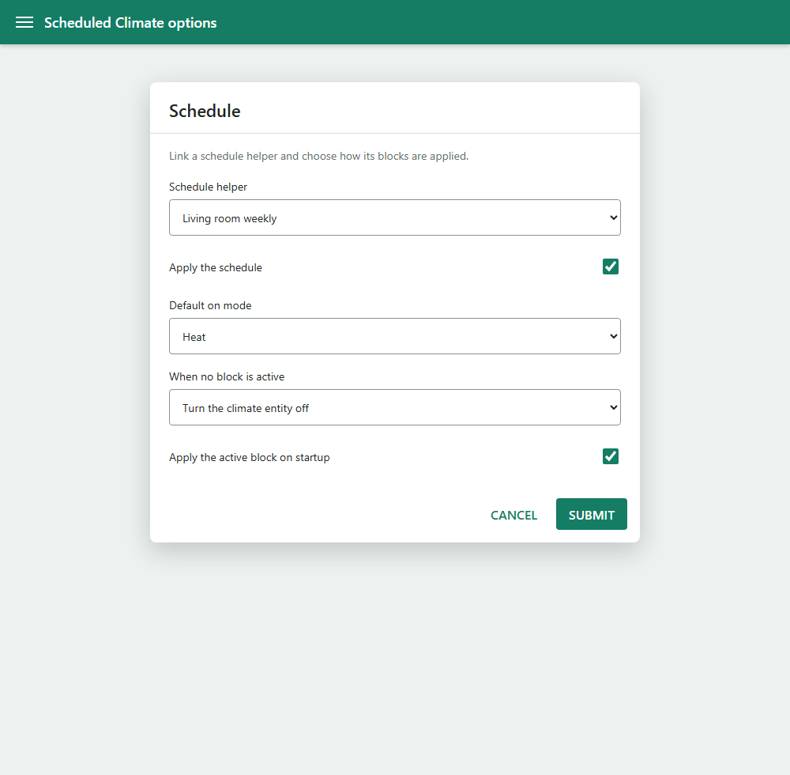

# Scheduled Climate User Guide

Scheduled Climate wraps an existing Home Assistant climate entity with a weekly schedule, persistent one-shot timers, and a dashboard card. The original climate entity continues to communicate with the device; use the new Scheduled Climate entity for dashboard controls and automations that should participate in scheduling.

## Requirements

- Home Assistant 2026.1 or newer
- HACS, or a manual custom integration installation
- An existing `climate` entity to control
- An administrator account to create or edit schedules from the card

Local integration branding requires Home Assistant 2026.3 or newer. The integration registers its dashboard card automatically, so a separate Lovelace resource is not needed.

## Install

### HACS

1. Open **HACS > Integrations**.
2. Open the three-dot menu and choose **Custom repositories**.
3. Enter this repository URL, select **Integration**, and add it.
4. Find **Scheduled Climate** in HACS and select **Download**.
5. Restart Home Assistant.

### Manual installation

1. Copy `custom_components/scheduled_climate` into the `custom_components` directory in the Home Assistant configuration directory.
2. Restart Home Assistant.

After upgrading either installation, restart Home Assistant and force-refresh open dashboards if the card still shows an older version.

## Add the integration

1. Open **Settings > Devices & services**.
2. Select **Add integration**.
3. Search for and select **Scheduled Climate**.
4. Enter a recognizable name and select the existing climate entity to wrap.
5. Select **Submit**.


The integration creates a new climate entity, normally with a `_scheduled` suffix such as `climate.living_room_scheduled`. It rejects missing targets, another Scheduled Climate wrapper, and a target already used by another Scheduled Climate entry.

To change the controlled entity later, open **Settings > Devices & services > Scheduled Climate**, select the entry's three-dot menu, and choose **Reconfigure**. The wrapper follows an entity when its entity ID is renamed in Home Assistant.

## Configure schedule behavior

Open **Settings > Devices & services > Scheduled Climate**, select **Configure** on the entry, and set the schedule options.



| Setting | Behavior |
| --- | --- |
| **Schedule helper** | The Home Assistant schedule helper that owns the weekly time blocks. |
| **Apply the schedule** | Enables automatic application of active blocks. A helper must be selected before this can be enabled. |
| **Default on mode** | HVAC mode used when a block does not specify a mode and no recent supported active mode can be restored. |
| **When no block is active** | Either turns the target climate entity off or leaves its current state unchanged. |
| **Apply the active block on startup** | Immediately applies the current block after Home Assistant starts. Disable this when startup should preserve the device's current state until the next schedule transition. |

A schedule can also be created directly from the dashboard card. If no helper is linked, an administrator sees **Create schedule**. For integrations upgraded from the old daily schedule, this action converts the previous on/off interval into a block on every day and links the new helper.

## Add the dashboard card

1. Open a dashboard and select **Edit dashboard**.
2. Select **Add card**.
3. Search for **Scheduled Climate Card**.
4. Select the Scheduled Climate entity and adjust the card options.
5. Select **Save**.


The visual editor provides these options:

| Option | Purpose |
| --- | --- |
| **Entity** | Scheduled Climate wrapper displayed by the card. |
| **Card name** | Optional title override. |
| **Layout** | `standard` includes the circular current-temperature dial; `compact` removes it. |
| **Show schedule controls** | Shows or hides the weekly schedule section. |
| **Allow editing the schedule** | Allows administrator editing. Non-administrators always receive a read-only view. |
| **Day shown first** | Opens a selected weekday, or the current day when set to **Today**. |
| **Show timer controls** | Shows or hides one-shot timer controls. |
| **Timer presets** | Positive, comma-separated minute values shown as quick choices. |

### YAML configuration

```yaml
type: custom:scheduled-climate-card
entity: climate.living_room_scheduled
name: Living room
layout: compact
show_schedule: true
schedule_editable: true
default_schedule_day: monday
show_timer: true
timer_presets:
  - 15
  - 30
  - 60
  - 120
```

The complete standard layout exposes every feature supported by the wrapped target, including temperature ranges, HVAC modes, presets, fan, swing, horizontal swing, and humidity.


The compact layout retains the same controls while using less vertical space.


The preset/options, schedule, and timer sections can be collapsed independently. Collapse state is stored per entity in the current browser.

## Build a weekly schedule

The card edits the linked Home Assistant schedule helper directly.

1. Open the **Schedule** section on the card.
2. Select a weekday.
3. Select **Add block**, or use the pencil button to modify an existing block.
4. Choose **From** and **To** times.
5. Add the climate settings to apply during the block.
6. Select **Save block**.
7. Optionally use **Copy to** to replace another day's blocks with the selected day's blocks.


Blocks on the same day cannot overlap. The card sorts blocks by start time and validates them before updating the helper.

Each block can contain the following data:

| Key | Meaning |
| --- | --- |
| `hvac_mode` | HVAC mode applied first. |
| `temperature` | Single target temperature. |
| `target_temp_low` and `target_temp_high` | Target range; provide both values. |
| `fan_mode` | Fan mode. |
| `humidity` | Target humidity. |

The editor only shows settings supported by the target entity. If a helper is edited elsewhere and includes an unsupported value, Scheduled Climate applies the supported parts, logs the skipped parts, and creates a repair issue.

When a block begins, its HVAC mode is applied before its setpoint. If the block omits `hvac_mode`, the integration restores the most recently active supported mode and otherwise uses **Default on mode**. When no block is active, **When no block is active** determines whether the target turns off or remains unchanged.

Schedule editing requires a Home Assistant administrator because the schedule helper WebSocket API is administrator-only. Other users can view the week but cannot add, duplicate, edit, delete, or copy blocks.

## Use one-shot timers

The timer section can turn the wrapper on or off after a delay:

1. Select a preset or enter a positive number of minutes.
2. Select **Turn on later** or **Turn off later**.
3. Use the cancel button beside an active timer to clear it.

Only one timer can be active for each wrapper. Starting another timer replaces the current timer. Deadlines are stored in UTC and survive restarts. If a deadline passes while Home Assistant is stopped, the action runs once after startup and the timer is cleared.

### Automation examples

Turn the living room off after 45 minutes:

```yaml
action: scheduled_climate.start_off_timer
target:
  entity_id: climate.living_room_scheduled
data:
  duration:
    minutes: 45
```

Cancel its active timer:

```yaml
action: scheduled_climate.cancel_timer
target:
  entity_id: climate.living_room_scheduled
```

Link a schedule helper from an automation or Developer Tools. `schedule_id` is the helper's storage ID, normally the object ID without the `schedule.` domain:

```yaml
action: scheduled_climate.link_schedule
target:
  entity_id: climate.living_room_scheduled
data:
  schedule_id: living_room_weekly
```

Call `scheduled_climate.link_schedule` without `schedule_id` to unlink the current helper.

## Repairs and migration

Scheduled Climate creates a repair issue when:

- an upgraded entry still needs its legacy daily times converted or linked to a helper;
- a linked schedule helper no longer exists;
- an active block contains settings the target cannot accept.

Open **Settings > System > Repairs** for details. Legacy daily times remain available on the wrapper until they are converted, so the card can create a weekly helper without losing the old interval.

## Troubleshooting

### The card is missing from the card picker

1. Confirm Home Assistant was restarted after installation or upgrade.
2. Force-refresh the browser or clear the Home Assistant frontend cache.
3. Confirm the Scheduled Climate integration entry is loaded. The card resource is registered automatically from a content-versioned URL.

### The wrapper is unavailable

Confirm the target climate entity exists and is available. Use **Reconfigure** if the wrapper should control a different entity.

### The schedule does not run

1. Open the integration options and confirm **Schedule helper** is selected.
2. Confirm **Apply the schedule** is enabled.
3. Check that the current time is inside a helper block.
4. Confirm the target supports the block's HVAC mode and setpoint type.
5. Check **Settings > System > Repairs** for a missing helper or unsupported block setting.

### A timer does not start

Timer services require a duration greater than zero. Confirm the automation targets the Scheduled Climate wrapper, not the original device entity.

### Collect diagnostics

Open **Settings > Devices & services > Scheduled Climate**, select the entry's three-dot menu, and choose **Download diagnostics**. Diagnostics include entry options, linked schedule state, current block, next event, issues, and target state. They do not include timer deadlines or integration credentials.

For detailed logs, enable debug logging:

```yaml
logger:
  logs:
    custom_components.scheduled_climate: debug
```

Restart Home Assistant after changing `configuration.yaml`, reproduce the issue, and include the relevant log entries and diagnostics in a bug report.
